## Accounts Receivable Support – Uplinq Solution Guide  
*Level 1 (Record & Monitor Service)*

---

### At‑a‑Glance  
| | **What We Do** | **What We Don't Do** |
|---|---|---|
| **Invoice Creation** | Generate and send professional invoices from your accounting system (QBO/Xero). | Design custom invoice templates or brand collateral. |
| **Payment Tracking** | Monitor outstanding payments and maintain aging receivables reports. | Make collection calls or negotiate payment plans on your behalf. |
| **Reminder Setup** | Configure automated payment reminders for overdue accounts. | Pursue legal action or debt collection for severely delinquent accounts. |
| **Payment Processing** | Set up payment acceptance through integrated payment gateways. | Handle cash or check deposits unless you upgrade to Premium service. |
| **Customer Records** | Maintain detailed customer profiles with payment histories. | Develop customer acquisition or retention strategies. |

---

### Service Flavors  
| **Name** | **Invoice Volume** | **Typical Fit** |
|----------|-------------------|-----------------|
| **A/R Basic** | Up to 50 invoices monthly | Service businesses with consistent client base. |
| **A/R Standard** | 51-150 invoices monthly | Growing SMBs with expanding customer lists. *(+Volume Fee applies)* |

> **Important:** Our service focuses on invoice management and tracking. For full collections management (including collection calls), upgrade to **A/R Premium**.

---

### Monthly Cadence  

```mermaid
gantt
    dateFormat  DD
    title  Monthly A/R Timeline
    section Client
    Approve Invoices :done, 01, 5d
    section Uplinq
    Send Invoices :active, after Approve Invoices, 3d
    Set Up Reminders :after Send Invoices, 2d
    Generate A/R Aging : 25, 2d
    section Client
    Review Month-End Reports : 28, 3d
```

| Timeline | Deliverable | Owner |
|---------|-------------|-------|
| **1st-5th** | Approve draft invoices | Client |
| **By 10th** | All invoices sent | Uplinq |
| **Weekly** | Reminder status updates | Uplinq |
| **By 25th** | A/R aging report delivered | Uplinq |

*Reports are delivered via dashboard and email notification.*

---

### What We Need From You  
1. **Customer Database** – contact details, payment terms, credit limits.  
2. **Invoice Details** – amounts, descriptions, dates, special terms.  
3. **Accounting Access** – Accountant-level user in QBO/Xero.  
4. **Payment Gateway** – Access to configured payment processor.  
5. **Approval Workflow** – Timely review of draft invoices before sending.

---

### Common "Not Included" Items  
- Making collection calls to late-paying customers.  
- Negotiating payment plans or settlements.  
- Creating custom-designed invoice templates.  
- Managing customer credit applications.  
- Personal visits to customers for collections.  

---

### Pricing Snapshot*  
| Monthly Invoices | **A/R Basic** | **A/R Standard** |
|-----------------|--------------|-----------------|
| Up to 50 | $500 | N/A |
| 51 – 100 | N/A | $775 |
| 101 – 150 | N/A | $950 |

\*One‑time setup fee applies for customer import & system configuration.

---

### Frequently Asked Questions  

<Callout type="info" title="Q: Can you customize our invoice template with our branding?">
Basic branding (logo, colors) is included. For custom designs with special fields or layouts, we can refer you to our design partners.
</Callout>

<Callout type="info" title="Q: Do you integrate with any CRM systems?">
Yes, we support integrations with popular CRMs like Salesforce, HubSpot, and Zoho CRM. Custom integrations may require additional setup fees.
</Callout>

<Callout type="info" title="Q: How do you handle recurring invoices?">
We can set up automatic recurring invoices for subscription services, retainers, or other regular billing cycles.
</Callout>

<Callout type="info" title="Q: What payment methods can customers use?">
We support credit cards, ACH/bank transfers, and digital wallets through integrated payment processors. Check and cash handling requires A/R Premium.
</Callout>

<Callout type="info" title="Q: Can I see real-time payment status?">
Yes, our client dashboard provides real-time visibility into payment status, with automatic notifications when payments are received.
</Callout>

---

### Related Articles  
- 🔗 *Getting Started with Uplinq*  
- 🔗 *Setting Up Payment Gateways*  
- 🔗 *Understanding A/R Aging Reports*  

---

Still have questions? Open a ticket from the dashboard or email **support@uplinq.com** – faster payments mean better cash flow! 💸